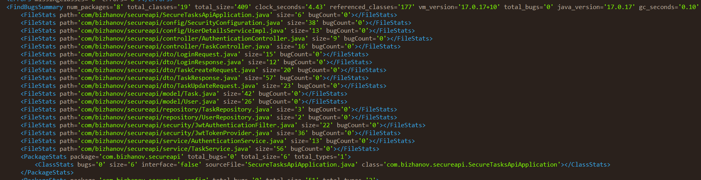
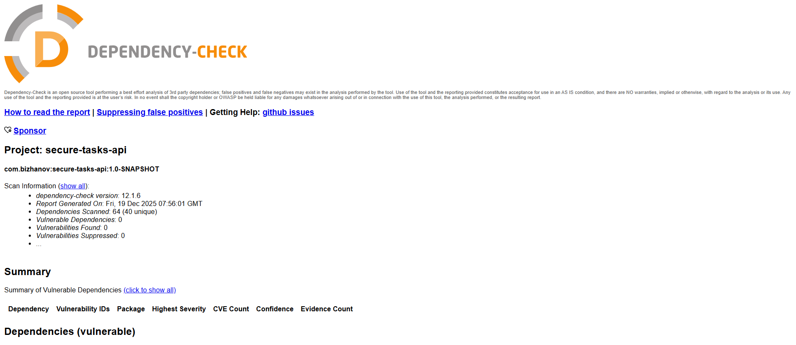

# Secure Tasks API

Information Security Lab #1, ITMO SE (Spring Boot/Java)

Защищенное REST API для управления задачами с интеграцией в CI/CD.

---

## Описание проекта

Проект представляет собой защищенное REST API приложение на Spring Boot для управления персональными задачами. API защищено от основных уязвимостей из OWASP Top 10 и включает автоматизированную проверку безопасности через CI/CD pipeline.

**Основные особенности:**
- Аутентификация через JWT токены
- Хранение пользователей и задач в базе данных SQLite
- Защита от SQL-инъекций через параметризованные запросы
- Защита от XSS через санитизацию и HTTP заголовки
- BCrypt хэширование паролей
- CI/CD pipeline с SAST и SCA сканерами

---

## Технологии

* **Spring Boot 3.5.5** — фреймворк для создания приложений
* **Spring Security** — безопасность и аутентификация
* **Spring Data JDBC** — работа с базой данных через параметризованные запросы
* **JWT (jjwt)** — JSON Web Tokens для аутентификации
* **BCrypt** — хэширование паролей
* **SQLite** — база данных
* **Lombok** — уменьшение boilerplate кода
* **Jakarta Bean Validation** — валидация входных данных

---

## Методы API

### 1. `POST /auth/login` — Аутентификация пользователя

**Описание:**
Метод принимает логин и пароль пользователя. В случае успешной аутентификации возвращает JWT-токен.

**Request:**

```http
POST /auth/login
Content-Type: application/json
```

```json
{
  "username": "admin",
  "password": "admin123"
}
```

**Response (200 OK):**

```json
{
  "accessToken": "eyJhbGciOiJIUzI1NiIsInR5cCI6IkpXVCJ9..."
}
```

**Ошибки:**

* `403 Forbidden` — если логин/пароль неверны.
* `400 Bad Request` — если данные невалидны (например, пустые поля).

---

### 2. `GET /api/data` — Получение списка задач

**Описание:**
Возвращает список всех задач текущего аутентифицированного пользователя. Доступ только для аутентифицированных пользователей (с валидным JWT).

**Request:**

```http
GET /api/data
Authorization: Bearer <JWT>
```

**Response (200 OK):**

```json
[
  {
    "id": 1,
    "title": "Изучить Spring Security",
    "description": "Изучить основы безопасности в Spring Boot",
    "status": "IN_PROGRESS",
    "priority": "HIGH",
    "createdAt": "2024-01-15T10:30:00",
    "updatedAt": "2024-01-16T14:20:00"
  },
  {
    "id": 2,
    "title": "Написать отчет",
    "description": "Подготовить отчет по лабораторной работе",
    "status": "PENDING",
    "priority": "MEDIUM",
    "createdAt": "2024-01-17T09:00:00",
    "updatedAt": "2024-01-17T09:00:00"
  }
]
```

**Ошибки:**

* `403 Forbidden` — если отсутствует или невалиден JWT.

---

### 3. `POST /api/data` — Создание новой задачи

**Описание:**
Создает новую задачу для текущего аутентифицированного пользователя. Доступ только для аутентифицированных пользователей.

**Request:**

```http
POST /api/data
Authorization: Bearer <JWT>
Content-Type: application/json
```

```json
{
  "title": "Завершить проект",
  "description": "Доделать все задачи по проекту",
  "priority": "HIGH"
}
```

**Response (201 Created):**

```json
{
  "id": 3,
  "title": "Завершить проект",
  "description": "Доделать все задачи по проекту",
  "status": "PENDING",
  "priority": "HIGH",
  "createdAt": "2024-01-18T12:00:00",
  "updatedAt": "2024-01-18T12:00:00"
}
```

**Ошибки:**

* `400 Bad Request` — если данные невалидны (например, пустой title или неверный priority).
* `403 Forbidden` — если отсутствует или невалиден JWT.

**Валидные значения priority:** `LOW`, `MEDIUM`, `HIGH`

---

### 4. `PUT /api/data/{id}` — Обновление задачи

**Описание:**
Обновляет существующую задачу. Пользователь может обновлять только свои задачи. Доступ только для аутентифицированных пользователей.

**Request:**

```http
PUT /api/data/1
Authorization: Bearer <JWT>
Content-Type: application/json
```

```json
{
  "title": "Изучить Spring Security (обновлено)",
  "status": "COMPLETED",
  "priority": "LOW"
}
```

**Response (200 OK):**

```json
{
  "id": 1,
  "title": "Изучить Spring Security (обновлено)",
  "description": "Изучить основы безопасности в Spring Boot",
  "status": "COMPLETED",
  "priority": "LOW",
  "createdAt": "2024-01-15T10:30:00",
  "updatedAt": "2024-01-18T15:00:00"
}
```

**Ошибки:**

* `400 Bad Request` — если данные невалидны.
* `403 Forbidden` — если отсутствует или невалиден JWT.
* `404 Not Found` — если задача не найдена или принадлежит другому пользователю.

**Валидные значения status:** `PENDING`, `IN_PROGRESS`, `COMPLETED`  
**Валидные значения priority:** `LOW`, `MEDIUM`, `HIGH`

---

## Меры защиты

### Противодействие SQL Injection (SQLi)

**Реализация:**
* Используется **Spring Data JDBC** с параметризованными запросами через `@Query` аннотации.
* Все запросы к базе данных выполняются через репозитории, которые автоматически используют Prepared Statements.
* Параметры передаются через `@Param` аннотации, что исключает возможность SQL-инъекций.

**Пример безопасного кода:**
```java
@Query("SELECT * FROM tasks WHERE user_id = :userId ORDER BY created_at DESC")
List<Task> findAllByUserId(@Param("userId") Long userId);
```

Spring Data JDBC автоматически подставляет параметры безопасным способом, исключая конкатенацию строк в SQL-запросах.

---

### Противодействие XSS (Cross-Site Scripting)

**Реализация:**
* REST API возвращает **только JSON**, что исключает выполнение JavaScript на клиенте.
* Устанавливаются защитные HTTP-заголовки:
  * `X-XSS-Protection: 1; mode=block` — включает встроенную защиту браузера от XSS.
  * `Content-Security-Policy: script-src 'self'; object-src 'none'` — ограничивает выполнение скриптов только с того же источника и запрещает объекты.
* Все пользовательские данные валидируются через Jakarta Bean Validation (`@NotBlank`, `@Pattern`).
* Данные из базы данных возвращаются как есть, но поскольку API возвращает только JSON, XSS-атаки через API невозможны.

**Конфигурация в SecurityConfiguration:**
```java
.headers(headers -> headers
    .xssProtection(xss -> xss.headerValue(XXssProtectionHeaderWriter.HeaderValue.ENABLED_MODE_BLOCK))
    .contentSecurityPolicy(csp -> csp.policyDirectives("script-src 'self'; object-src 'none'"))
)
```

---

### Реализация аутентификации (Broken Authentication Prevention)

**Реализация:**

1. **JWT-токены:**
   * При успешной аутентификации пользователь получает JWT-токен, подписанный секретным ключом (HMAC-SHA256).
   * Токен содержит информацию о пользователе (username) и время истечения (2 часа).
   * Токен передается в заголовке `Authorization: Bearer <token>`.

2. **Middleware для проверки JWT:**
   * Реализован фильтр `JwtAuthenticationFilter`, который проверяет наличие и валидность JWT-токена на всех защищенных эндпоинтах.
   * Фильтр извлекает токен из заголовка, валидирует его и устанавливает аутентификацию в Spring Security Context.

3. **Хэширование паролей:**
   * Пароли **никогда не хранятся в открытом виде**.
   * Используется алгоритм **BCrypt** с фактором сложности 10.
   * BCrypt автоматически добавляет соль (salt) к каждому паролю, что делает атаки по словарю и радужным таблицам неэффективными.
   * Пароли хранятся в таблице `users` в поле `password_hash`.

4. **Хранение пользователей в БД:**
   * В отличие от in-memory хранилища, пользователи хранятся в базе данных SQLite.
   * Это позволяет масштабировать приложение и добавлять новых пользователей.

**Пример хэширования:**
```java
@Bean
public PasswordEncoder passwordEncoder() {
    return new BCryptPasswordEncoder(10);
}
```

**Проверка пароля:**
```java
if (!passwordEncoder.matches(password, user.getPasswordHash())) {
    throw new RuntimeException("Invalid credentials");
}
```

**Почему BCrypt предпочтительнее SHA-256:**
* BCrypt специально разработан для хэширования паролей и включает встроенную соль.
* BCrypt адаптивен (можно увеличивать фактор сложности со временем).
* SHA-256 — быстрая криптографическая хэш-функция, не предназначенная для паролей (уязвима к атакам по словарю и радужным таблицам).

---

## Скриншоты отчетов безопасности

### SpotBugs (SAST) отчет



### OWASP Dependency-Check (SCA) отчет



---

